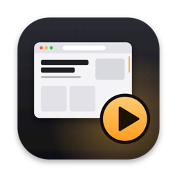
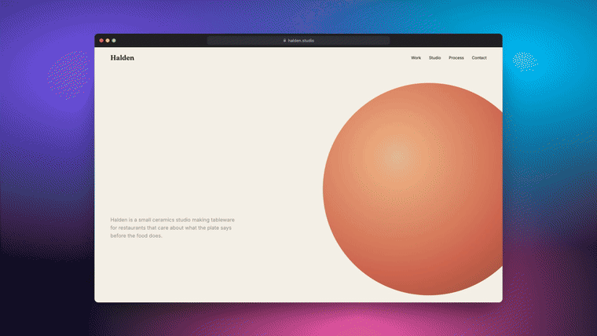
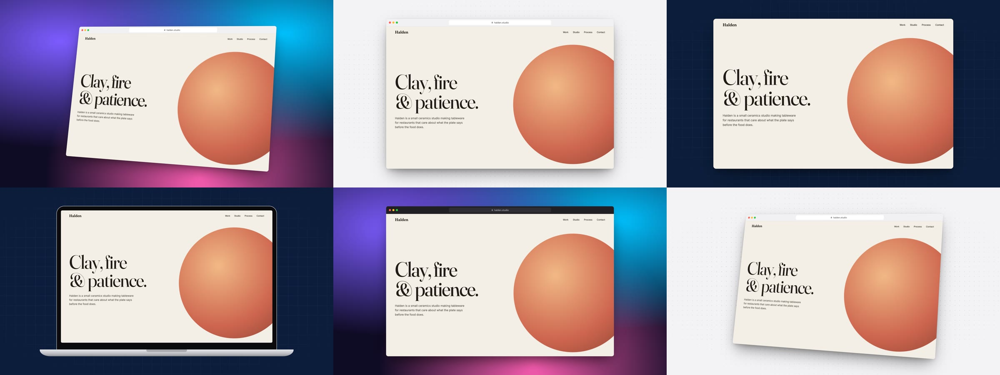
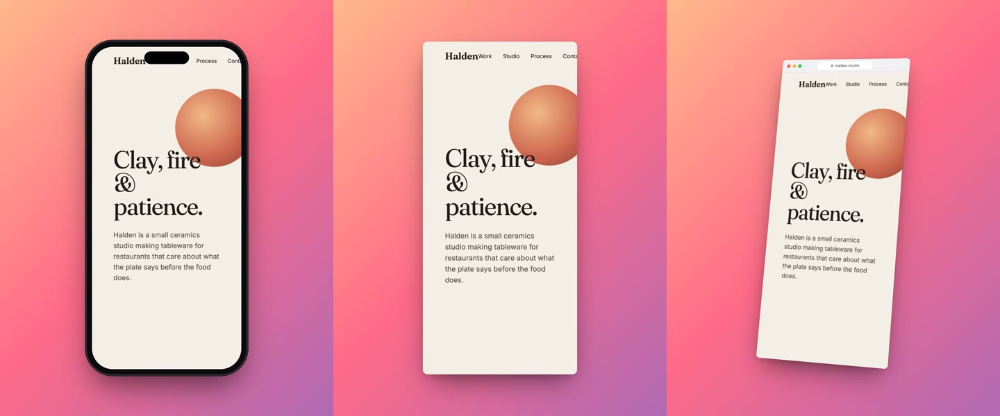
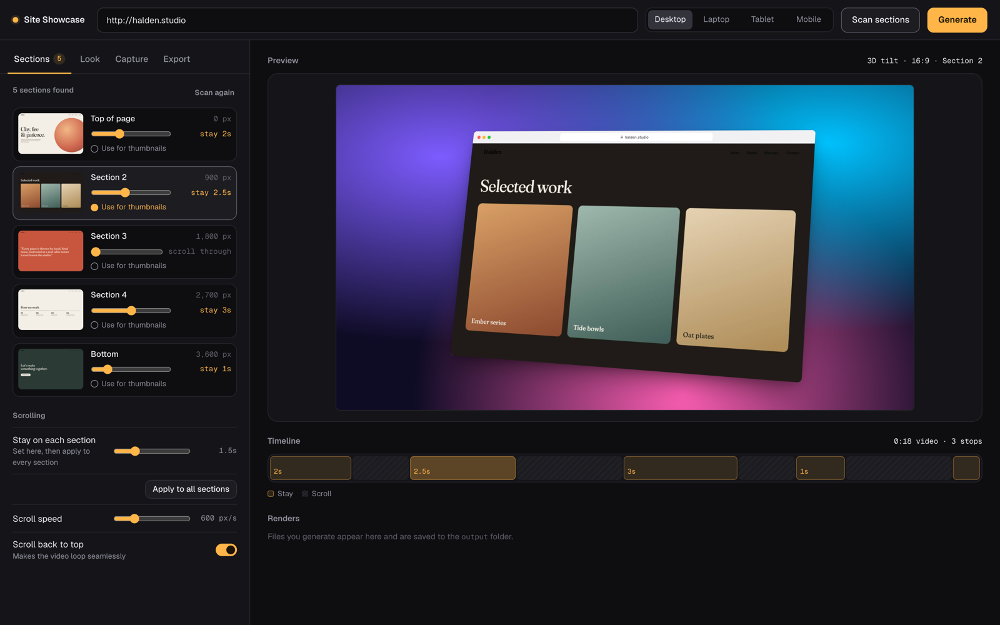
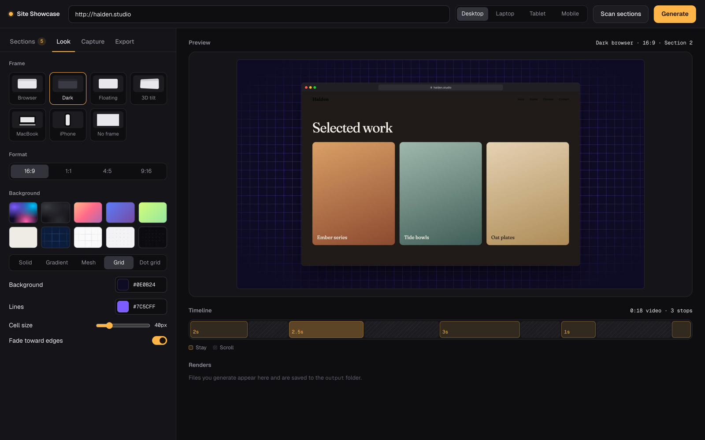

<div align="center">



# Site Showcase

**Paste a URL. Get a buttery-smooth scroll video, a polished mockup video, and portfolio-ready thumbnails.**

A local macOS app for agencies and freelancers who want to show off the websites they've built,
with every scroll animation and effect captured frame-perfectly.




<sub>Generated by Site Showcase from a fictional demo site. Every frame comes straight from the tool.</sub>

</div>

---

## Contents

- [What you get](#what-you-get)
- [Highlights](#highlights)
- [Install](#install)
- [How to use it](#how-to-use-it)
- [Settings reference](#settings-reference)
- [How it works](#how-it-works)
- [Customizing](#customizing)
- [Troubleshooting](#troubleshooting)
- [Project structure](#project-structure)
- [License](#license)

---

## What you get

For every website you run through it, Site Showcase saves a folder in `output/<site>-<date>/` with:

| File | What it is |
| --- | --- |
| `<site>-scroll.mp4` | The site scrolling on its own, full-bleed. Up to **2880×1800 @ 60 fps** (Retina). |
| `<site>-mockup-<frame>.mp4` | The same scroll inside a device or browser frame on a background of your choice. |
| `<site>-thumb-<frame>.jpg` | High-res thumbnails in **every** frame style, ready for your portfolio grid. |
| `<site>-fullscreen.png` | A clean screenshot of one screen of the site: no frame, no background. |
| `<site>-fullpage.png` | The entire page, top to bottom, in one tall image. |



Capture the mobile version too, and use a portrait format for Instagram or Reels:



---

## Highlights

**🎞 Frame-perfect smoothness, in the background.**
Pages are rendered frame by frame on a *virtual clock*: the page's time only moves forward when the next frame is captured. Scroll position, CSS transitions, GSAP/Framer Motion timelines, WebGL scenes and background videos all advance exactly 1/60 s per frame, so the video never stutters, however heavy the site or however busy your Mac. No window opens and nothing records your screen.

**🧭 Plan the video section by section.**
*Scan sections* loads the page, detects each section and shows a thumbnail of it. Decide how long the video stays on each one so its effects can finish, set `0` to scroll straight through, and pick which section becomes the thumbnail. A **timeline** shows exactly what the video will do and how long it will be before you render.

**🖼 Seven frames, five background types, every colour yours.**
Browser (light or dark), floating card, 3D tilt, MacBook, iPhone, or no frame at all.
Backgrounds can be **solid, gradient, mesh, grid or dot grid**, each with a colour picker plus hex input for your brand colours, adjustable angle, cell size and edge fade. The preview uses the real renderer, so what you see is what you export.

**⚡️ Screenshots-only mode.**
Turn videos off to get the full-screen shot, thumbnails and full-page image in seconds.

**🍪 Clean captures.**
Cookie banners and chat widgets are hidden automatically, including custom-built ones, and scrollbars never appear.

**🧲 Works with tricky sites.**
Smooth-scroll libraries (Lenis, Locomotive), scroll snapping, pinned sections, scroll-direction-dependent animations and inner scroll containers are all handled. Thumbnails are taken by replaying the video's exact path, so they always match what the video shows.

---

## Install

**You need:** macOS, [Node.js 20+](https://nodejs.org) and [ffmpeg](https://ffmpeg.org).

```bash
brew install node ffmpeg
```

Then clone and install:

```bash
git clone https://github.com/ioanniszygoulakis/site-showcase.git
cd site-showcase
npm install
npx playwright install chromium
```

### Install the Mac app (recommended)

```bash
./macos/build-app.sh
```

This builds **Site Showcase.app** with its own icon and installs it in `/Applications`. Open it from Launchpad or Spotlight, then right-click its Dock icon → **Options → Keep in Dock**.

The app opens in its own window, starts the tool in the background and stops it when you quit (⌘Q). It adds **File → Open Output Folder** (⇧⌘O), saves downloads to `~/Downloads`, and writes logs to `~/Library/Logs/Site Showcase.log`.

> The app remembers where this folder lives. If you move the project, run `./macos/build-app.sh` again.

### Or run it without the app

**Double-click `Start Site Showcase.command`** in Finder (the first launch installs anything missing), or run:

```bash
npm start
```

The app opens at **http://localhost:4321**. To use another port, set `PORT` (e.g. `PORT=5000 npm start`).

> The first time you double-click the `.command` file, macOS may block it. Right-click → **Open** once, and it will run normally from then on.

---

## How to use it



1. **Paste the URL** in the top bar and choose a **device**: Desktop, Laptop, Tablet or Mobile.
2. Click **Scan sections**. After a few seconds you'll see every section of the page.
3. For each section, set **how long to stay**. Use longer stays where the effects are slow, and `0` to glide past a section. Click **Use for thumbnails** on the section that makes the best cover image.
4. Check the **Timeline** under the preview: amber blocks are stays, striped blocks are scrolling. Click a block to preview that section.
5. In **Look**, pick a frame, a format (16:9, 1:1, 4:5, 9:16) and a background.
6. In **Export**, choose what to generate: videos, full-screen screenshot, thumbnails.
7. Hit **Generate**. Progress shows under *Renders*, and a notification tells you when it's ready.
8. Preview the files inline and click **Download** on any of them, or **Download all** for the whole set. Files go straight to your Downloads folder with a confirmation, and the button turns into **Show in Finder**. Clicking again never creates duplicate copies.

You can skip the scan: the video will then stop automatically at each section it finds, using the *Stay on each section* value.



---

## Settings reference

### Sections

| Setting | What it does |
| --- | --- |
| **Stay (per section)** | Seconds the video holds on that section. `0` = scroll through without stopping. |
| **Use for thumbnails** | The section used for the full-screen screenshot and all thumbnails. |
| **Stay on top of page** | *(no scan)* Time on the hero before scrolling, so intro animations can play. |
| **Stay on each section** | *(no scan)* Pause at every detected section; `0` = one continuous scroll. With a scan, **Apply to all sections** copies this value to every section. |
| **Stay at the bottom** | *(no scan)* Hold at the end of the page. |
| **Scroll speed** | How fast the page moves between stops, in pixels per second. |
| **Scroll back to top** | Scrolls back up at the end so the video loops seamlessly. |

### Look

| Setting | Options |
| --- | --- |
| **Frame** | Browser · Dark browser · Floating · 3D tilt · MacBook · iPhone · No frame |
| **Format** | 16:9 (1920×1080) · 1:1 (1080×1080) · 4:5 (1080×1350) · 9:16 (1080×1920) |
| **Background** | 10 presets, or build your own: **Solid**, **Gradient** (2–3 colours, angle), **Mesh** (base + 3 glows), **Grid** (lines, cell size, edge fade), **Dot grid** (dots, spacing, edge fade) |

### Capture

| Setting | What it does |
| --- | --- |
| **Retina (2×)** | Captures at double resolution (e.g. 2880×1800). Sharper, takes about twice as long. |
| **Frame rate** | 30 or 60 fps. |
| **Hide cookie banners & chat** | Removes consent popups and chat bubbles from the capture. |
| **Scroll method** | *Smooth* sets the scroll position directly (best for most sites). *Wheel* sends real mouse-wheel events; try it if a site with a custom scroller doesn't move. |
| **Max length** | Caps the video length for one continuous scroll. |

### Export

| Setting | What it does |
| --- | --- |
| **Scroll video + mockup video** | Turn off for screenshots only (much faster). |
| **Full-screen screenshot** | One screen of the site with no frame or background. |
| **Thumbnails in every frame** | A JPG of the thumbnail section in each frame style that suits the device. |
| **Screenshot position** | *(no scan)* How many screens down to take the screenshots. |

Your settings are remembered between sessions.

---

## How it works

```
Browser UI ──► server.js ──► recorder.js ──► headless Chromium (Playwright, Metal GPU)
                                   │               └─ virtual-time.js injected into the page
                                   ├─► screenshots every frame at exact 1/fps intervals
                                   ├─► templates/mockup.html renders each frame into the chosen frame + background
                                   └─► ffmpeg encodes H.264 MP4s (frames are piped, not stored twice)
```

- **Virtual clock** (`virtual-time.js`): before any page script runs, `requestAnimationFrame`, `setTimeout`/`setInterval`, `performance.now()` and `Date.now()` are wrapped. Once recording starts, time only advances when the recorder calls `step()`. CSS and Web Animations are paused and driven through `currentTime`, and playing `<video>` elements are advanced by seeking. Each frame is therefore rendered exactly on schedule, whatever a screenshot costs.
- **Section scan**: finds section-sized elements, adds extra stops inside very tall ones, and captures each position with the scroll pinned on the virtual clock, so snap-scrolling libraries can't move the page away.
- **Matching thumbnails**: some sites show different content depending on how you arrive at a section. Thumbnails are captured by replaying the video's own path (same stops, pauses and speed), so they match the video exactly.
- **Mockups**: `templates/mockup.html` is both the renderer and the app's live preview, and backgrounds come from one shared file (`templates/backgrounds.js`), so preview and output always match.
- **GPU**: Chromium runs headless with Metal (ANGLE) acceleration, which keeps WebGL-heavy sites fast.

A 15-second clip at Retina/60 fps typically takes 1–2 minutes. A screenshots-only run takes seconds.

---

## Customizing

**Add a background preset.** Open `templates/backgrounds.js` and add an entry to `BG_PRESETS`:

```js
brand: { type: 'gradient', a: '#0f172a', b: '#6d28d9', c: '#f472b6', angle: 120 },
```

Types are `solid`, `gradient`, `mesh`, `grid` and `dots` (see `BG_TYPES` in the same file for the fields each one uses). The preset appears in the app automatically.

**Tweak or add frames.** Every frame is plain CSS in `templates/mockup.html`: `.browser-light`, `.macbook`, `.iphone` and so on. The layout is measured automatically, so frames of any shape fit the canvas.

**Change output sizes.** `FORMATS` in `recorder.js` maps each format to its pixel size.

---

## Troubleshooting

| Problem | Fix |
| --- | --- |
| *"Can't reach the app"* | The server isn't running. Relaunch **Site Showcase.app** (or `npm start`) and reload the page. |
| The app says it can't find the folder | You moved the project. Run `./macos/build-app.sh` again. |
| The site doesn't scroll in the video | Set **Capture → Scroll method** to **Wheel**. |
| An effect hasn't finished when the video moves on | Scan sections and increase that section's **stay**. |
| The thumbnail shows the wrong moment | Pick a different section with **Use for thumbnails**, or change its stay time: the thumbnail matches the end of that stay. |
| A hover or mouse-follow effect is missing | Effects that need real mouse movement aren't captured. Everything driven by scroll or time is. |
| Rendering is slow | Turn off **Retina**, use **30 fps**, or shorten stays. Very long pages with many stops take longer. |
| `ffmpeg failed` / disk-full error | Frames are stored temporarily while rendering; free some disk space and try again. |
| Port 4321 is already in use | The app is probably already running, and the launcher just opens it. Or start on another port: `PORT=5000 npm start`. |

---

## Project structure

```
site-showcase/
├── Start Site Showcase.command   # double-click launcher (installs deps on first run)
├── server.js                     # local web server + job API (/api/scan, /api/jobs)
├── recorder.js                   # page loading, section scan, frame capture, mockups, encoding
├── virtual-time.js               # the virtual clock injected into captured pages
├── public/
│   └── index.html                # the app UI
├── templates/
│   ├── mockup.html               # frame renderer (also the live preview)
│   └── backgrounds.js            # background types + presets, shared by UI and renderer
├── macos/
│   ├── SiteShowcase.swift        # native app: window, server lifecycle, menus, downloads
│   ├── build-app.sh              # builds + installs Site Showcase.app
│   ├── Info.plist
│   ├── icon.svg                  # the app icon (rendered to .icns at build time)
│   └── render-icon.mjs
├── docs/                         # README images
└── output/                       # your renders (git-ignored)
```

---

## License

[MIT](LICENSE) © Ioannis Zygoulakis

<div align="center"><sub>Built for showing off good work.</sub></div>
